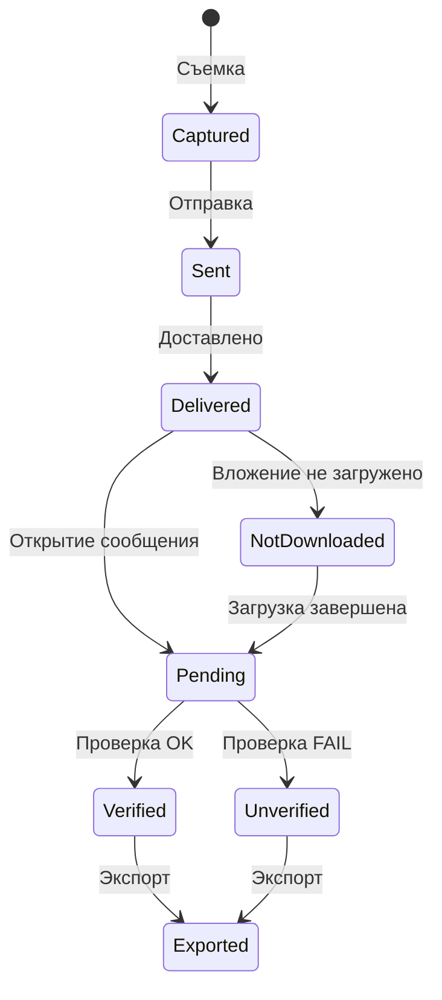

# Snapshot — Подписанное фото

**Версия:** 1.0  
**Статус:** Draft  
**Владелец:** System Analyst  
**Дата создания:** 15 сентября 2025  
**Последнее обновление:** 15 сентября 2025

---

## 1. Краткое описание

Мы разрабатываем **Evidence-фотографии** — снимки с криптографической подписью, которые можно проверить на подлинность прямо на устройстве получателя без интернета.

### Проблема<br>
Пользователи часто сомневаются в подлинности фотографий в мессенджерах. Споры "это фото отредактировано" возникают регулярно, особенно в важных ситуациях.

### Решение<br>
Фотографии, сделанные в Evidence-режиме, содержат криптографические доказательства того, что они сняты конкретным устройством в определенное время и не были изменены.

### Критерии успеха<br>
- 95% Evidence-фото успешно проверяются с первой попытки<br>
- Время проверки <300мс (95-й перцентиль)<br>
- 0 ложно-положительных результатов проверки подлинности<br>

---

## 2. Границы проекта

### Входит в v1.0
- **Основной функционал:** съемка, отправка, проверка, экспорт Evidence-фото<br>
- **Платформы:** iOS ≥15.0, Android ≥11.0 (API level 30)<br>
- **Сеть:** проверка работает офлайн<br>
- **UI:** четкие визуальные индикаторы статуса Evidence и результатов проверки<br>

### Не входит в v1.0
- Desktop приложения<br>
- Evidence для видео<br>
- Серверные метки времени<br>
- Редактирование фото в Evidence-режиме<br>
- Водяные знаки<br>
- Защита от скриншотов<br>

---

## 3. Участники процесса

| Участник | Роль |
|----------|------|
| **Отправитель** | Включает Evidence-режим, фотографирует, отправляет в чат |
| **Получатель** | Получает фото, видит результат автоматической проверки подлинности |
| **Мобильное приложение** | Обеспечивает съемку, упаковку метаданных, проверку, экспорт |
| **Система проверки** | Локальная логика проверки подписи и метаданных (офлайн) |
| **Чат-система** | Канал доставки сообщений с Evidence-фото |

---

## 4. Бизнес-правила

### BR-1: Только съемка
Evidence работает **исключительно** при съемке через камеру приложения. Загрузка из галереи, импорт файлов, редактирование запрещены.

**Обоснование:** только так можно гарантировать неизмененность изображения.

### BR-2: Уникальные идентификаторы
Каждый Evidence-снимок получает глобально уникальный `evidence_id`, который никогда не повторяется в системе.

### BR-3: Дубликаты разрешены
Повторная отправка одного снимка в тот же чат создает отдельные сообщения. Дедупликация **не применяется**.

**Обоснование:** пользователь может намеренно отправлять важные доказательства несколько раз.

### BR-4: Автоматическая проверка офлайн
Проверка подлинности выполняется:
- Автоматически при открытии сообщения получателем<br>
- Полностью офлайн (без обращения к серверам)<br>
- При каждом открытии заново (результат не кешируется)<br>

### BR-5: Приватность по умолчанию
Геолокация по умолчанию **отключена**. Пользователь может включить ее явно для конкретного снимка.

### BR-6: Стандартный экспорт
Экспорт файла происходит через системный диалог сохранения. При конфликте имен добавляется суффикс `(1)`, `(2)`, etc.

### BR-7: Сохранение ID при пересылке
При пересылке (forward) Evidence-фото в другие чаты исходный `evidence_id` сохраняется, создается новое сообщение.

---

## 5. Пользовательские сценарии (Use Cases)

### UC-1: Съемка Evidence-фото

**Цель:** создать фотографию с доказательством подлинности<br>

**Предусловия:**<br>
- Evidence-режим включен в камере<br>
- Есть доступ к камере<br>
- Достаточно свободного места (минимум 50MB)<br>

**Основной сценарий:**<br>
1. Пользователь видит индикатор "Evidence: Активен" в интерфейсе камеры<br>
2. Нажимает кнопку съемки<br>
3. Приложение делает снимок и автоматически добавляет криптографические метаданные<br>
4. Показывается превью с опциями "Отправить" или "Отменить"<br>
5. Снимок готов к отправке<br>

**Исключительные сценарии:**<br>
- **E1:** Недостаточно места → показать диалог с предложением освободить место<br>
- **E2:** Нет доступа к камере → запросить разрешение, при отказе объяснить как включить в настройках<br>

**Постусловия:**
- Evidence-фото готово к отправке<br>
- Файл содержит оригинальное изображение + криптографические метаданные<br>

**Связанные требования:** BR-1, BR-2, BR-5

---

### UC-2: Отправка в чат

**Цель:** поделиться Evidence-фото с другими пользователями

**Предусловия:**<br>
- Evidence-фото создано и готово к отправке<br>
- Выбран чат/группа/канал для отправки<br>

**Основной сценарий:**<br>
1. Пользователь нажимает "Отправить"<br>
2. Сообщение отправляется с прикрепленными метаданными<br>
3. У отправителя в ленте появляется сообщение с индикатором Evidence<br>
4. У получателей появляется превью с автоматически определенным статусом проверки<br>

**Особые случаи:**<br>
- **Повторная отправка:** создается дубликат сообщения (BR-3)<br>
- **Пересылка:** `evidence_id` сохраняется, создается новое сообщение в чате назначения (BR-7)<br>

**Постусловия:**<br>
- Сообщение доставлено получателям<br>
- Метаданные для проверки прикреплены к сообщению<br>

**Связанные требования:** BR-2, BR-3, BR-7<br>

---

### UC-3: Автоматическая проверка получателем

**Цель:** автоматически определить подлинность полученного Evidence-фото<br>

**Предусловия:**<br>
- Получено сообщение с Evidence-фото<br>
- Вложение загружено на устройство<br>

**Основной сценарий:**<br>
1. Получатель открывает сообщение с Evidence-фото<br>
2. Приложение автоматически запускает локальную проверку (без интернета)<br>
3. Выполняется проверка подписи и целостности метаданных<br>
4. Показывается один из статусов:<br>
   - ✅ **"Проверено"** — подпись валидна, снимок не изменен<br>
   - ❌ **"Не проверено"** — подпись недействительна или метаданные повреждены<br>
   - ⬇️ **"Загрузите вложение"** — файл еще не скачан<br>

**Исключительные сценарии:**<br>
- **E1:** Вложение не загружено → показать статус "Загрузите вложение для проверки"<br>
- **E2:** Метаданные повреждены → статус "Не проверено: метаданные повреждены"<br>
- **E3:** Подпись недействительна → статус "Не проверено: подпись недействительна"<br>

**Постусловия:**<br>
- Получатель видит результат проверки подлинности<br>
- Результат не кешируется — проверка выполняется при каждом открытии<br>

**Связанные требования:** BR-4<br>

---

### UC-4: Экспорт пакета доказательств

**Цель:** сохранить Evidence-фото с метаданными в отдельный файл

**Предусловия:**<br>
- Evidence-фото доступно на устройстве<br>
- Есть свободное место (минимум размер фото × 1.1)<br>

**Основной сценарий:**<br>
1. Пользователь нажимает "Экспорт пакета" в детальном экране проверки<br>
2. Открывается системный диалог выбора места сохранения<br>
3. Пользователь выбирает папку и подтверждает имя файла<br>
4. Создается ZIP-архив с именем `evidence_<id>.zip`<br>
5. Показывается уведомление об успешном сохранении<br>

**Исключительные сценарии:**<br>
- **E1:** Нет доступа к файлам → запросить разрешение, при отказе объяснить как включить<br>
- **E2:** Файл с таким именем существует → автоматически добавить суффикс `(1)`, `(2)`, etc.<br>
- **E3:** Ошибка записи → показать "Не удалось сохранить, попробуйте позже"<br>

**Постусловия:**<br>
- ZIP-файл сохранен в выбранной пользователем папке<br>
- Файл содержит оригинальное фото + все метаданные + manifest.json<br>

**Связанные требования:** BR-6<br>

---

## 6. Пользовательские истории с критериями приемки

### US-1: Съемка в Evidence-режиме
```gherkin
Функция: Съемка Evidence-фото

Сценарий: Успешная съемка в Evidence-режиме
  Дано Evidence-режим включен в камере
  Когда я нажимаю кнопку съемки
  Тогда я вижу превью фотографии
  И криптографические метаданные автоматически добавлены
  И я могу выбрать отправить или отменить
  И у фото есть уникальный evidence_id

Сценарий: Блокировка загрузки из галереи в Evidence-режиме
  Дано Evidence-режим включен
  Когда я пытаюсь выбрать фото из галереи
  Тогда действие заблокировано
  И я вижу сообщение "Evidence-режим требует съемки через камеру"
```

### US-2: Офлайн проверка
```gherkin
Функция: Офлайн проверка подлинности

Сценарий: Автоматическая проверка при открытии сообщения
  Дано я получил сообщение с Evidence-фото
  И у моего устройства нет подключения к интернету
  Когда я открываю сообщение
  Тогда проверка выполняется автоматически и локально
  И я вижу результат проверки в течение 300мс
  И результат либо "Проверено", либо "Не проверено" с указанием причины

Сценарий: Проверка когда вложение не загружено
  Дано я получил сообщение с Evidence-фото
  И вложение не загружено
  Когда я открываю сообщение
  Тогда я вижу статус "Загрузите вложение для проверки"
  И проверка не выполняется
```

### US-3: Экспорт пакета
```gherkin
Функция: Экспорт пакета Evidence

Сценарий: Экспорт в выбранное место
  Дано у меня есть Evidence-фото на устройстве
  Когда я нажимаю "Экспорт пакета"
  Тогда открывается системный файловый диалог
  И я могу выбрать место сохранения и имя файла
  И создается ZIP-файл с фото и метаданными
  И размер файла меньше 20MB

Сценарий: Обработка конфликта имен файлов
  Дано я экспортирую пакет Evidence
  И файл с таким именем уже существует
  Когда я подтверждаю экспорт
  Тогда к новому файлу автоматически добавляется суффикс "(1)"
  И оба файла существуют одновременно
```

---

## 7. Функциональные требования

### FR-1: Evidence-режим ограничения<br>
Приложение **ДОЛЖНО** блокировать следующие действия в Evidence-режиме:<br>
- Импорт фото из галереи<br>
- Редактирование снимков<br>
- Применение фильтров<br>
- Кадрирование<br>

### FR-2: Уникальность идентификаторов<br>
Каждое Evidence-фото **ДОЛЖНО** иметь глобально уникальный `evidence_id` в формате `ev_<timestamp>_<random>`.

### FR-3: Проверка без кеширования
Проверка подлинности **ДОЛЖНА**:<br>
- Выполняться при каждом открытии сообщения<br>
- Работать полностью офлайн<br>
- Не сохранять результаты проверки<br>

### FR-4: Структура экспорта
Экспорт **ДОЛЖЕН** создавать ZIP-архив содержащий:<br>
- Оригинальное изображение (JPEG)<br>
- Файл метаданных (JSON)<br>
- Манифест с описанием содержимого (manifest.json)<br>

---

## 8. Нефункциональные требования

### NFR-1: Производительность
- Проверка подлинности ≤ 300мс (95-й перцентиль)<br>
- Время от съемки до превью ≤ 500мс (95-й перцентиль)<br>
- Экспорт файла ≤ 2 секунд (95-й перцентиль)<br>

### NFR-2: Офлайн работа
Все основные функции **ДОЛЖНЫ** работать без интернета:<br>
- Съемка Evidence-фото<br>
- Проверка подлинности<br>
- Экспорт пакета<br>

**Исключение:** отправка сообщений требует подключения к серверу.

### NFR-3: Ограничения размера
- Максимальный размер экспортируемого ZIP ≤ 20MB<br>
- Минимум свободного места для съемки: 50MB<br>

### NFR-4: Поддержка платформ
- iOS ≥ 15.0<br>
- Android ≥ 11.0 (API level 30)<br>

### NFR-5: Визуальная обратная связь
Статус Evidence **ДОЛЖЕН** быть всегда видимым в интерфейсе:<br>
- В камере: индикатор "Evidence: Активен"<br>
- В сообщениях: бейджи статуса проверки<br>
- В деталях: полная информация о проверке<br>

---

## 9. Пользовательский интерфейс

### 9.1 Состояния проверки

| Состояние | Иконка | Текст | Описание |
|-----------|---------|-------|-----------|
| **Pending** | ⏳ | Проверка... | Выполняется проверка подлинности |
| **Verified** | ✅ | Проверено | Подпись валидна, фото не изменено |
| **Unverified** | ❌ | Не проверено | Подпись недействительна или метаданные повреждены |
| **Not Downloaded** | ⬇️ | Загрузите вложение | Файл не загружен, проверка невозможна |

### 9.2 Макеты интерфейса

#### Камера с Evidence-режимом
```
┌─────────── Камера ────────────┐
│                               │
│  Evidence: [✓] Активен 🛡️     │
│  ℹ️ Фото будет подписано       │
│                               │
│            [ ● ]              │
│                               │
│  [Галерея]          [Настрой] │
└───────────────────────────────┘
```

#### Сообщение с Evidence-фото
```
┌─────────────────────────────┐
│  Иван Петров  14:25         │
│  ┌─────────────────┐    ✅   │
│  │                 │        │
│  │   [превью фото] │        │
│  │                 │        │
│  └─────────────────┘        │
│  Evidence: Проверено        │
└─────────────────────────────┘
```

#### Экран детальной проверки
```
┌────── Проверка Evidence ──────┐
│                               │
│  Целостность: ✅ OK            │
│  Подпись:     ✅ Валидна       │
│  Устройство:  ✅ Подтверждено  │
│                               │
│  ID: ev_01J8Z5G3X9K2M7...     │
│  Устройство: iPhone 15 Pro    │
│  Система: iOS 18.2            │
│  Приложение: Telegram 12.3.1  │
│  Время съемки: 15.09.25 14:25 │
│  Геолокация: не добавлена     │
│                               │
│  [Экспорт пакета]  [Закрыть]  │
└───────────────────────────────┘
```

---

## 10. Обработка ошибок

### 10.1 Таблица ошибок

| Код | Контекст | Сообщение пользователю | Интерфейс |
|-----|----------|------------------------|-----------|
| `NO_SPACE_CAPTURE` | Съемка | "Недостаточно места для сохранения фото" | Диалог + кнопка "Освободить место" |
| `NO_CAMERA_ACCESS` | Съемка | "Разрешите доступ к камере для съемки Evidence" | Диалог + кнопка "Настройки" |
| `ATTACHMENT_NOT_DOWNLOADED` | Проверка | "Загрузите вложение для проверки подлинности" | Бейдж ⬇️ + тап для загрузки |
| `METADATA_CORRUPTED` | Проверка | "Не удалось проверить: метаданные повреждены" | Бейдж ⚠️ |
| `SIGNATURE_INVALID` | Проверка | "Подпись недействительна" | Бейдж ❌ |
| `EXPORT_NO_ACCESS` | Экспорт | "Разрешите доступ к файлам для сохранения" | Диалог + кнопка "Настройки" |
| `EXPORT_FAILED` | Экспорт | "Не удалось сохранить пакет. Попробуйте позже" | Toast-уведомление |
| `EXPORTED_OK` | Экспорт | "Пакет сохранен: evidence_abc123.zip" | Toast + кнопка "Открыть папку" |

### 10.2 Стратегии восстановления

**Для критичных ошибок:**
- Предоставить четкие инструкции по устранению<br>
- Добавить кнопки для быстрого перехода в настройки<br>
- Показать альтернативные способы достижения цели<br>

**Для временных ошибок:**
- Предложить повторить действие<br>
- Показать прогресс при повторных попытках<br>
- Предоставить возможность отмены длительных операций<br>

---

## 11. Жизненный цикл Evidence-фото



---

## 12. Критерии готовности (Definition of Ready)

Задача считается готовой к разработке, если:<br>

- [ ] Все Use Cases связаны с конкретными бизнес-правилами<br>
- [ ] Описаны все возможные ошибки и способы их обработки<br>
- [ ] Определены UI-состояния и переходы между ними<br>
- [ ] Установлены четкие правила экспорта файлов<br>
- [ ] Зафиксированы ограничения (офлайн-работа, только камера)<br>
- [ ] Написаны приемочные тесты в формате Gherkin<br>
- [ ] Определены метрики успеха и способы их измерения<br>

---

## 13. Критерии приемки (Definition of Done)

Функция считается завершенной, если:

- [ ] Повторная отправка создает дубликаты сообщений
- [ ] При пересылке сохраняется исходный `evidence_id`
- [ ] Проверка работает офлайн и выполняется при каждом открытии
- [ ] Время проверки не превышает 300мс (95-й перцентиль)
- [ ] Все ошибки обрабатываются согласно таблице
- [ ] Экспорт создает ZIP-файл размером до 20MB с корректным именем
- [ ] Геолокация по умолчанию отключена
- [ ] Все макеты интерфейса реализованы pixel-perfect
- [ ] Покрытие автотестами ≥ 85%
- [ ] Прошли security review и privacy review

---

## 14. Открытые вопросы

### Q1: Уведомления о Evidence-режиме
**Вопрос:** Показывать ли дополнительное уведомление при первом включении Evidence-режима?

**Предлагаемое решение:** Да, показать onboarding с объяснением что такое Evidence и для чего используется.

**Статус:** 🔄 Требует решения PM

### Q2: История проверок
**Вопрос:** Нужно ли локально сохранять историю проверок для аналитики?

**Предлагаемое решение:** Нет, в v1.0 не сохраняем. Проверяем каждый раз заново для максимальной актуальности.

**Статус:** ✅ Принято

### Q3: Формат экспорта
**Вопрос:** Нужно ли стандартизировать формат ZIP-архива для совместимости с внешними инструментами?

**Предлагаемое решение:** Да, определить четкую структуру:
```
evidence_<id>.zip
├── photo.jpg           # Оригинальное изображение
├── metadata.json       # Криптографические метаданные  
└── manifest.json       # Описание содержимого архива
```

**Статус:** 🔄 Требует согласования с Security Team

### Q4: Ограничения на размер фото
**Вопрос:** Какие ограничения на разрешение и размер файла Evidence-фото?

**Предлагаемое решение:** Использовать стандартные ограничения мессенджера. Для Evidence дополнительных ограничений не вводим.

---
