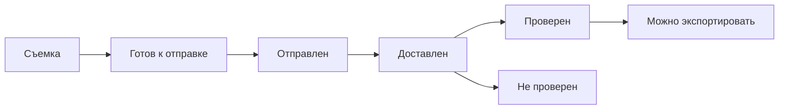

# Snapshot — Подписанное фото

**Версия:** 0.1
**Статус:** Draft  
**Владелец:** System Analyst  
**Дата:** 2025-09-15

---

> **Что входит в скоуп:** только поведение системы — пользовательские сценарии, правила, ожидания от интерфейса.  
> **Что НЕ входит в скоуп:** структуры данных, криптография, API, нефункциональные требования по производительности, план развертывания, архитектурные решения.

## Зачем это нужно

Мы делаем **Evidence-снимки** — фотографии, которые можно проверить на подлинность прямо на устройстве получателя, без интернета. 

**Проблема:** подлинность фото частая претензия в спорных ситуациях.  
**Решение:** снимок содержит криптографические доказательства того, что он сделан именно этим устройством в это время и не был изменен.

**Как это работает:** фотографируем через приложение → к снимку добавляется "цифровая подпись" → отправляем в чат → получатель видит статус проверки автоматически.

## Что делаем в первой версии

### Делаем
- **iOS и Android** — мобильные приложения
- **Только съемка** из камеры приложения (никаких загрузок из галереи)
- **Автопроверка** при получении сообщения (работает офлайн)
- **Экспорт** готового пакета доказательств в файл

### НЕ делаем в v1
- Desktop версии
- Видео (только фото)
- Редактирование или обрезку снимков в Evidence режиме
- Водяные знаки
- Серверную верификацию времени
- Защиту от скриншотов или AI-генерации

## Кто что делает

**Отправитель** — включает Evidence режим, фотографирует, отправляет в чат  
**Получатель** — получает сообщение, видит результат автоматической проверки  
**Приложение** — обеспечивает съемку, упаковку доказательств и проверку

## Основные правила

### BR-001: Только съемка
Evidence работает исключительно при съемке через камеру приложения. Загрузка из галереи, редактирование, обрезка — все запрещено в Evidence режиме.

*Почему:* только так мы можем гарантировать, что фото не было изменено.

### BR-002: Уникальный ID
Каждый Evidence-снимок получает уникальный идентификатор `evidence_id`, который не повторяется во всем продукте.

### BR-003: Дубликаты разрешены
Если отправить один и тот же Evidence-снимок в чат несколько раз — появится несколько отдельных сообщений. Это нормально.

*Почему:* пользователь может захотеть отправить важное доказательство несколько раз для надежности.

### BR-004: Автопроверка офлайн
Когда получатель открывает сообщение с Evidence-снимком, проверка происходит автоматически на его устройстве, без интернета. Результат не кешируется — проверяем каждый раз заново.

### BR-005: Геолокация по умолчанию выключена
По умолчанию Evidence-снимки не содержат геолокацию. Отправитель может добавить ее по желанию.

*Почему:* приватность важнее полноты метаданных.

### BR-006: Экспорт через системный диалог
Экспорт файла происходит через стандартный системный диалог сохранения. Если файл с таким именем уже существует, добавляем суффикс `(1)`, `(2)` и так далее.

### BR-007: Пересылка сохраняет ID
При пересылке (forward) Evidence-снимка в другой чат создается новое сообщение, но `evidence_id` остается тот же. Проверка работает как обычно.

## Пользовательские сценарии

### UC-01: Сделать Evidence-снимок

**Что хочет пользователь:** получить фотографию с доказательствами подлинности

**Как это происходит:**
1. Пользователь включает Evidence режим в камере
2. Нажимает кнопку съемки
3. Приложение делает снимок и автоматически добавляет к нему метаданные с цифровой подписью
4. Показывается превью — можно отправить или отменить

**Что может пойти не так:**
- Мало места на устройстве → показать ошибку и предложить освободить место
- Нет доступа к камере → запросить разрешение, если отказ — объяснить как включить в настройках

**Связанные требования:** BR-001 (только съемка), BR-005 (геолокация выключена)

---

### UC-02: Отправить в чат

**Что хочет пользователь:** поделиться Evidence-снимком с другими людьми

**Как это происходит:**
1. После съемки нажать "Отправить"
2. Выбрать чат, группу или канал
3. Снимок отправляется как обычное сообщение, но с прикрепленными метаданными
4. У получателей появляется превью с индикатором Evidence

**Особенности:**
- Можно отправить один снимок в несколько чатов — каждый раз новое сообщение
- При пересылке `evidence_id` сохраняется
- Повторная отправка в тот же чат создает дубликат (это нормально)

**Связанные требования:** BR-002 (уникальный ID), BR-003 (дубликаты ОК), BR-007 (пересылка)

---

### UC-03: Проверка у получателя

**Что хочет пользователь:** понять, можно ли доверять этому снимку

**Как это происходит:**
1. Получатель открывает сообщение с Evidence-снимком
2. Автоматически запускается проверка (работает без интернета)
3. Показывается статус: "Проверено" или "Не проверено" с объяснением

**Возможные результаты проверки:**
- **Проверено:** подпись валидна, снимок не изменен
- **Не проверено:** подпись недействительна, метаданные повреждены или отсутствуют
- **Невозможно проверить:** вложение еще не загружено

**Что может пойти не так:**
- Вложение не скачано (отключена автозагрузка) → показать подсказку "Загрузите вложение для проверки"
- Поврежденные метаданные → показать "Не проверено" с причиной

**Связанные требования:** BR-004 (автопроверка офлайн)

---

### UC-04: Экспорт пакета доказательств

**Что хочет пользователь:** сохранить Evidence-снимок как отдельный файл для архива или передачи

**Как это происходит:**
1. В экране проверки нажать "Экспорт пакета"
2. Открывается системный диалог выбора места сохранения
3. Выбрать папку и имя файла
4. Сохраняется один файл (например, `evidence_abc123.zip`) со снимком и всеми метаданными

**Что может пойти не так:**
- Нет доступа к файлам → запросить разрешение, объяснить как включить в настройках
- Мало места → показать ошибку "Недостаточно места, попробуйте позже"
- Файл с таким именем уже есть → автоматически добавить `(1)`, `(2)` и т.д.

**Связанные требования:** BR-006 (экспорт через системный диалог)

## Пользовательские истории с критериями приемки

### История 1: Съемка в Evidence режиме
```gherkin
Дано Evidence режим включен в камере
Когда я нажимаю кнопку съемки
Тогда я получаю готовый к отправке снимок
И к нему автоматически добавлены метаданные с подписью
И я вижу превью с возможностью отправить или отменить
```

### История 2: Блокировка редактирования в Evidence
```gherkin
Дано Evidence режим включен
Когда я пытаюсь загрузить фото из галереи
Или пытаюсь отредактировать снимок
Тогда приложение блокирует эти действия
И показывает подсказку "В Evidence режиме доступна только съемка"
```

### История 3: Повторная отправка
```gherkin
Дано у меня есть Evidence-снимок
Когда я отправляю его в один чат несколько раз
Тогда в чате появляется несколько отдельных сообщений
И каждое содержит тот же evidence_id
И это ожидаемое поведение
```

### История 4: Проверка без интернета
```gherkin
Дано я получил Evidence-снимок
И у меня отключен интернет
Когда я открываю это сообщение
Тогда автоматически выполняется проверка подлинности
И я вижу результат: "Проверено" или "Не проверено"
И мне объясняют причину, если что-то не так
```

### История 5: Экспорт файла
```gherkin
Дано на моем устройстве есть Evidence-снимок
Когда я выбираю "Экспорт пакета"
Тогда открывается системный диалог сохранения
И после выбора места сохраняется один файл со всеми данными
И если имя занято, автоматически добавляется суффикс (1), (2)...
```

## Интерфейс

### Камера с Evidence режимом
```
┌─────────── Камера ───────────┐
│                              │
│  Evidence: [✓] 🛡 Активен    │
│                              │
│  ℹ️ К снимку будет добавлена  │
│    криптографическая подпись │
│                              │
│           [  ●  ]            │
│                              │
└──────────────────────────────┘
```

### Сообщение с Evidence-снимком
```
┌─────────────────────────────┐
│  Иван Петров                │ 
│  ┌─────────────────────┐     │
│  │  [превью фото]      │ ✅  │
│  │                     │     │ 
│  └─────────────────────┘     │
│  Evidence: Проверено         │
│  15 сент, 10:21              │
└─────────────────────────────┘
```

### Экран детальной проверки
```
┌──────── Проверка Evidence ────────┐
│                                   │
│  Целостность: ✅ Снимок не изменен │
│  Подпись:     ✅ Подпись валидна   │
│  Источник:    ✅ iPhone15,3        │
│                                   │
│  ID: ev_01J8Z5G3X9K2M7...         │
│  Устройство: iPhone15,3           │
│  Система: iOS 18.2               │
│  Приложение: Telegram 12.3       │
│  Время: 15 сент 2025, 10:21      │
│  Геолокация: не добавлена        │
│                                   │
│  [Экспорт пакета]  [Закрыть]     │
│                                   │
└───────────────────────────────────┘
```

## Обработка ошибок

### При съемке
- **Мало места:** "Недостаточно места для сохранения снимка. Освободите место и повторите."
- **Нет доступа к камере:** Системный запрос → если отказ: "Для Evidence нужен доступ к камере. Включите в Настройки > Приватность > Камера"

### При проверке
- **Поврежденные метаданные:** "Не удалось проверить подлинность: метаданные повреждены или отсутствуют"
- **Вложение не загружено:** "Загрузите вложение, чтобы проверить подлинность снимка"

### При экспорте
- **Нет доступа к файлам:** "Разрешите доступ к файлам для сохранения пакета"
- **Ошибка сохранения:** "Не удалось сохранить пакет. Проверьте свободное место и повторите."
- **Успешное сохранение:** "Пакет сохранен: evidence_abc123.zip"

## Жизненный цикл Evidence-снимка



## Нерешенные вопросы и решения

### Вопрос: Что если пользователь случайно отправил Evidence-снимок не в тот чат?
**Решение:** Можно пересылать как обычные сообщения. При пересылке `evidence_id` сохраняется, проверка работает в новом месте.

### Вопрос: Нужно ли предупреждать о включенном Evidence режиме?
**Решение:** Да, четко показываем статус "Evidence: активен" и объясняем что это значит.

### Вопрос: Что делать с большими группами — всем будет доступна проверка?
**Решение:** Да, проверка доступна всем участникам группы/канала, как и сам снимок.

### Вопрос: Можно ли отключить Evidence после съемки?
**Решение:** Нет, нельзя. Evidence снимок уже содержит метаданные. Можно сделать новый снимок с выключенным Evidence.

### Вопрос: Что показывать если проверка "зависла"?
**Решение:** Проверка должна быть быстрой (до 300ms). Если дольше — показать "Проверка..." с возможностью отмены.

### Вопрос: Какой формат экспортируемого файла?
**Решение:** Один файл (ZIP или специальный формат) содержащий снимок + метаданные. До 20 МБ максимум.

### Вопрос: Работает ли Evidence в режиме полета?
**Решение:** Съемка работает без сети. Отправка требует интернет. Проверка работает полностью офлайн.

---

## Что дальше

После реализации базовой функциональности можно добавить:
- Поддержку Desktop платформ  
- Evidence для видео
- Серверные метки времени для дополнительной верификации
- Интеграцию с блокчейн для долгосрочного хранения доказательств
